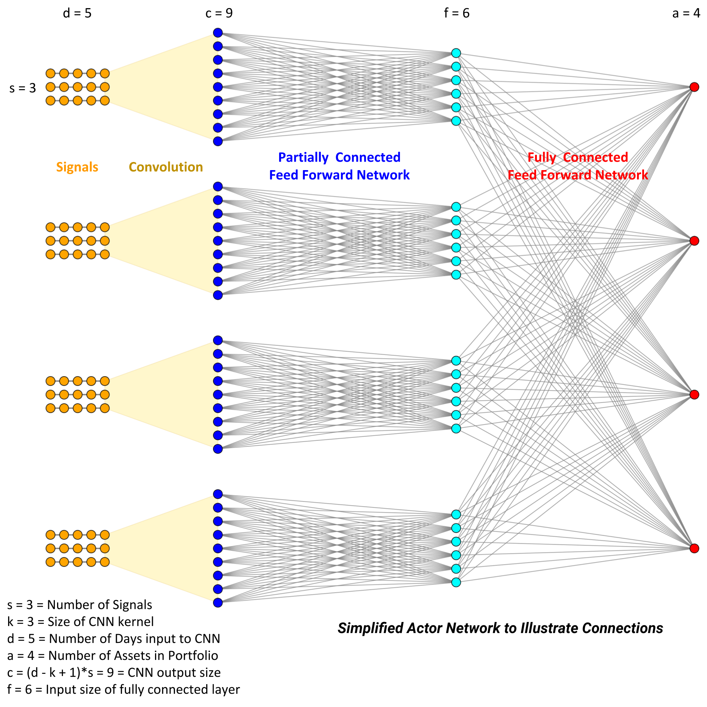
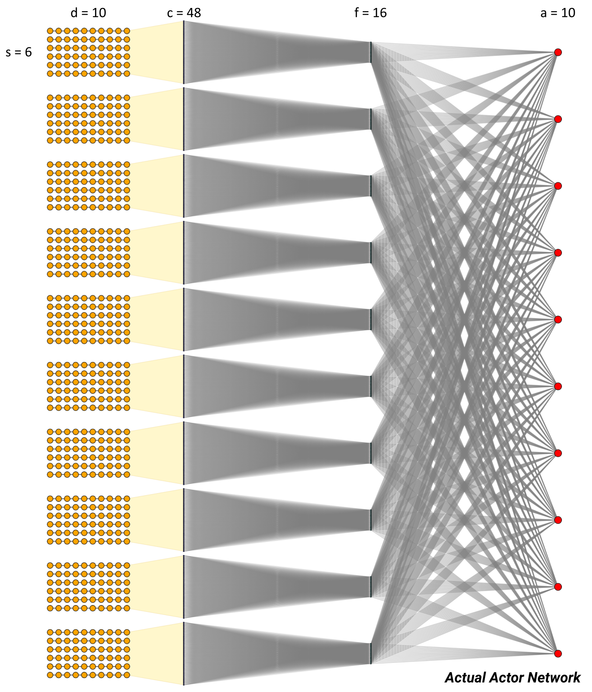
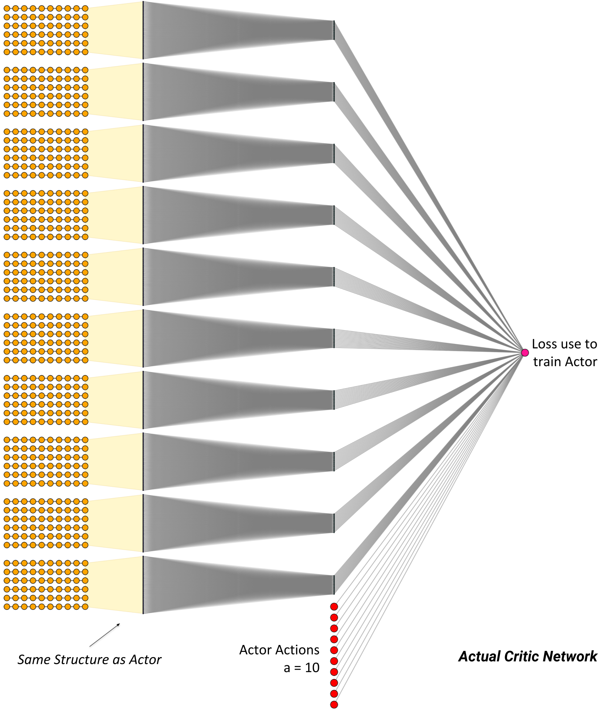

# DRL Portfolio Optimization Custom
A portfolio optimization framework leveraging Deep Reinforcement Learning (DRL) and a custom trading environment 
developed on AWS SageMaker.

### Table of Contents
- [Motivation](#motivation)
- [AWS SageMaker](#aws-sagemaker)
- [Incremental Approach](#incremental-approach)
  - [Custom DRL in a Toy Environment](#custom-drl-in-a-toy-environment)
  - [Custom Environment - Deterministic Time-Invariant Pricing](#custom-environment---deterministic-time-invariant-pricing)
  - [Testing - Real Pricing Information](#testing---real-pricing-information)
- [Results](#results)
  - [Trading Synthetic Data for a Year](#trading-synthetic-data-for-a-year)
  - [Trading Real Data for a Year](#trading-real-data-for-a-year)
  - [Trading Real Data for 2 Years](#trading-real-data-for-2-years)
- [Model Architecture](#model-architecture)
  - [Simplified Actor Network](#simplified-actor-network)
  - [Actual Actor Network](#actual-actor-network)
  - [Actual Critic Network](#actual-critic-network)
- [License](#license)
- [Contributions](#contributions)

## Motivation
This repo is an extension of a three term Independent Study of [Daniel Fudge](https://www.linkedin.com/in/daniel-fudge) 
with [Professor Yelena Larkin](https://www.linkedin.com/in/yelena-larkin-6b7b361b/) 
as part of a concurrent Master of Business Administration (MBA) and a [Diploma in Financial Engineering](https://schulich.yorku.ca/programs/fnen/)
from the [Schulich School of Business](https://schulich.yorku.ca/). 

Please see this [repo](https://github.com/daniel-fudge/DRL-Portfolio-Optimization) for a detailed description of the 
previous three terms. A YouTube [playlist](https://www.youtube.com/playlist?list=PLJtqqeC4KrwQos6A3uMbZloJgM54R0H12) 
was also created to document the implementation and results. 

This term was spawned in a new repo for clarity with less focus on the background and theory and more focus on the 
implementation and results. 

## AWS SageMaker
As discussed in [report 1](https://github.com/daniel-fudge/DRL-Portfolio-Optimization/blob/master/docs/report1.pdf), 
cloud computing is one of the key enablers that takes machine learning from theory and toy problems to real production 
applications. The Amazon Web Service ([AWS](https://aws.amazon.com/)) is the current industry leader in cloud computing 
and its [SageMaker](https://aws.amazon.com/sagemaker/) platform provides users with the ability to rapidly scale 
applications from small experiments to massively parallel production solutions.

This project levers the power of SageMaker. If you wish to run these models, it is recommend that you review 
this [playlist](https://www.youtube.com/playlist?list=PLhr1KZpdzukcOr_6j_zmSrvYnLUtgqsZz) from AWS. [A Cloud Guru](https://acloud.guru/)
also has excellent training on AWS and other cloud providers. 

## Incremental Approach
In the previous [term](https://github.com/daniel-fudge/DRL-Portfolio-Optimization), a DRL framework was developed for 
portfolio optimization but as was discussed in the future work [section](https://github.com/daniel-fudge/DRL-Portfolio-Optimization#training-process), 
the standard DRL training and test process is not well suited for portfolio optimization because the rules of the game 
keep changing. To build an realistic process we need to build a custom DRL algorithm and a custom train/test 
environment. Previously we relied on proven frameworks but since we will be building everything from scratch we will 
follow an incremental approach that proves the effectiveness of each component before increasing the complexity and 
difficulty. The first increment will be developed in a separate repo to isolate the development.

#### Custom DRL in a Toy Environment
Before beginning to develop the custom environment, the A Cloud Guru [Docker Fundamentals](https://acloud.guru/learn/docker-fundamentals)
and [AWS ECS - Scaling Docker](https://acloud.guru/learn/aws-ecs-scaling-docker) courses were completed. This [repo](https://github.com/daniel-fudge/sagemaker-tennis) 
then developed a custom DRL algorithm to solve the [Tennis](https://github.com/Unity-Technologies/ml-agents/blob/master/docs/Learning-Environment-Examples.md#tennis) 
environment provided by [Unity](https://unity3d.com/machine-learning/). The [SageMaker Python SDK](https://sagemaker.readthedocs.io/en/stable/frameworks/rl/using_rl.html)
is normally used when training DRL models on AWS. Unfortunately this is limited to the [Ray RLlib](https://docs.ray.io/en/master/rllib.html)
or [Coach](https://nervanasystems.github.io/coach/) tool kits, which can't be used for the custom training and testing 
environment we wish to develop. Therefore we built a custom [Docker](https://www.docker.com/resources/what-container) 
container, registered it in the AWS [ECR](https://aws.amazon.com/ecr/) and used the AWS [BYOD](https://sagemaker.readthedocs.io/en/stable/overview.html#byo-docker-containers-with-sagemaker-estimators)
functionality to demonstrate the capability required for the next increment.

#### Custom Environment - Deterministic Time-Invariant Pricing
This increment builds a custom training and test environment that replicates how the custom DRL would be deployed in 
production. To separate the environment development from the complexity of real trading data, simulated price data will 
be generated in a deterministic manner by functions that remain constant over time. This ensures that an effective 
process will be able to solve the environment. 

Please see this [notebook](synthetic.ipynb) for the generation of the synthetic price data. If you wish to run on your
local PC, please follow this [instructions](local-setup.md).

#### Testing - Real Pricing Information
In this final increment the process is applied to real signals as a final test. 
 
## Results 
#### Trading Synthetic Data for a Year 
As expected, the algorithm was able to achieve very high gains when trading the synthetic data as shown below. However, 
the true test is with the real pricing history.

#### Trading Real Data for a Year
As shown below, the gains from the real data was more modest and erratic.

#### Trading Real Data for 2 Years
We pushed the system trade over two years and achieved the performance below.

## Model Architecture
#### Simplified Actor Network
Below is a simplified network to illustrate the connections between each layer of the actor neural network.

#### Actual Actor Network
Below is the actual actor network selected by the hyperparameter tuning.

#### Actual Critic Network
Below is the actual critic network.

## License
This code is copyright under the [MIT License](LICENSE).

## Contributions
Please feel free to raise issues against this repo if you have any questions or suggestions for improvement.
